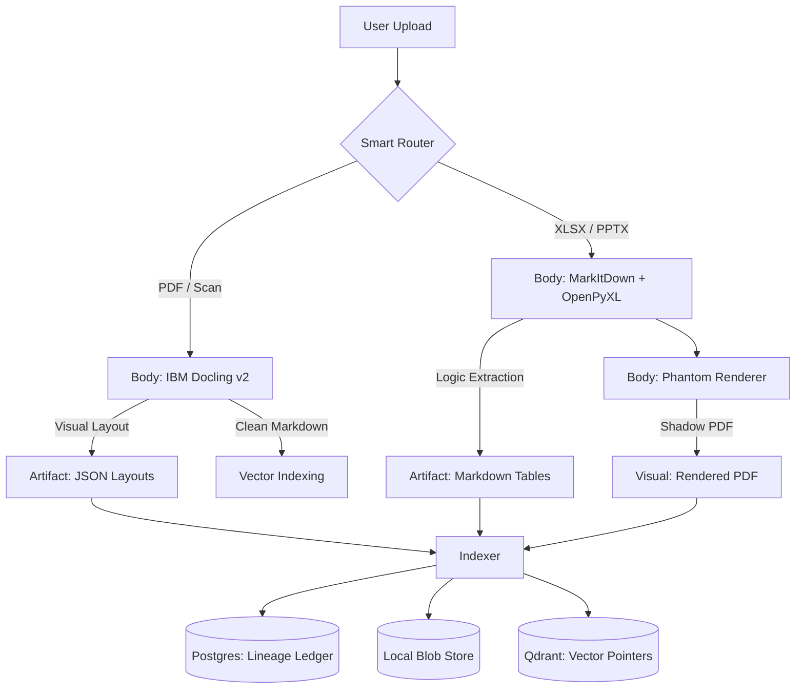

# CHIRON: High-Fidelity Underwriting RAG

**Status:** Alpha (Ingestion Engine Active)  
**Core Philosophy:** The "Centaur" Architecture (Local Body / Cloud Brain)  
**Python:** 3.11+ | **Stack:** Docker, Postgres, Qdrant, LangGraph

---

## 🏛️ Executive Summary

**Chiron** is a specialized Retrieval-Augmented Generation (RAG) engine designed for **Private Credit Underwriting**. Unlike generic chat bots, Chiron treats credit agreements, indentures, and financial models as structured databases, not unstructured text.

The system is engineered to solve the **"Trust Gap"** in financial AI by enforcing three non-negotiable standards:
1.  [cite_start]**Pixel-Perfect Grounding:** Every generated answer must point to verifiable coordinates (visual or native) in the source document[cite: 9, 52].
2.  **Audit-Ready Arithmetic:** The LLM is strictly forbidden from performing mental math. [cite_start]All calculations are executed via Python tools on extracted tabular data[cite: 400, 401].
3.  [cite_start]**Cost Discipline ("The Token Firewall"):** We maximize the use of local hardware (OCR, Layout Analysis, Embedding) to minimize API costs, sending only high-value reasoning tasks to the cloud[cite: 308, 309].

---

## 🏗️ The "Centaur" Architecture

[cite_start]Chiron operates on a hybrid "Body/Brain" model to balance cost and precision[cite: 307].

### 1. The Dual-Helix Ingestion Pipeline
We reject the "one-size-fits-all" ingestion approach. [cite_start]Files are routed based on their semantic structure[cite: 450, 451].



### 2. The Storage Layer: "The Three Truths"
[cite_start]To prevent "Metadata Bloat" in the Vector DB and ensure data integrity, Chiron decouples storage into three distinct layers[cite: 535, 562].

| Layer | Component | Role | Why? |
| :--- | :--- | :--- | :--- |
| **State Truth** | **PostgreSQL** (Docker) | **Lineage Ledger**. Tracks document status (Draft vs. Final), effective dates, and processing cost audit logs. | [cite_start]Prevents "Hallucinating Old Data" by filtering superseded drafts before retrieval[cite: 509, 511]. |
| **Content Truth** | **Local Blobs** (File System) | **Artifact Store**. Replaces Azure Blob Storage locally. Stores heavy `layouts/*.json` and `tables/*.md`. | Keeps the Vector DB lightweight. [cite_start]If the Vector Index is corrupted, it can be fully rebuilt from Blobs without re-ingesting[cite: 396]. |
| **Search Truth** | **Qdrant** (Docker) | **Pointer Index**. Stores embeddings and `chunk_id` references only. | [cite_start]Optimized for speed and semantic retrieval, not data storage[cite: 538]. |

### 3. The Reasoning Engine (Lexical Graph)
[cite_start]We utilize a **Lexical Graph** approach rather than "Semantic Hops" to solve the specific complexity of Credit Agreements[cite: 403, 426].

* **Term Injection:** A Regex-driven pass extracts "Article I: Definitions" during ingestion. [cite_start]These are stored as artifacts and injected into the LLM context *only* when the defined term is detected in the query[cite: 408, 411].
* [cite_start]**The Phantom DOM:** For native files (Excel), the system cites a "Shadow PDF" generated by Playwright, allowing the frontend to render "pixel-perfect" highlights even for spreadsheet cells[cite: 466, 467].

---

## 📂 Directory Structure & Design Intent

[cite_start]This structure is designed to facilitate a seamless migration to Azure[cite: 323].

```text
chiron/
├── data/                       # [SINGLE SOURCE OF TRUTH]
│   ├── inputs/                 # Drop zone for raw PDFs/Excel
│   ├── system/                 # The State Truth (Dev mode hook)
│   ├── blobs/                  # The Content Truth (Simulates Azure Blob Container)
│   │   ├── layouts/            # JSON Coordinate Maps
│   │   └── tables/             # Full Markdown Tables
│   └── shadow_cache/           # The Visual Truth (Phantom PDFs)
├── src/
│   ├── config.py               # Factory Pattern: Toggles OpenAI (Dev) <-> Azure (Prod)
│   ├── ingestion/              # [LOCAL BODY] The Dual-Helix Engine
│   │   ├── filters.py          # Token Firewall logic
│   │   ├── native_parser.py    # MarkItDown + OpenPyXL fallback
│   │   ├── pdf_parser.py       # Docling v2 with Visual Context Injection
│   │   ├── phantom.py          # Playwright "Shadow PDF" generator
│   │   ├── pipeline.py         # The Orchestrator
│   │   └── router.py           # Smart routing (Visual vs Native)
│   ├── retrieval/              # [SEARCH TRUTH - READ]
│   │   ├── qdrant.py           # Search Logic (The "Brain" uses this)
│   │   ├── sidecar.py          # Context Window Manager
│   │   └── term_injector.py    # Regex Definitions Extractor
│   ├── schemas/                # [TYPE SAFETY] Shared Pydantic Models
│   │   ├── citation.py         # "Pixel-Perfect" citation object
│   │   ├── documents.py        # Chunk definitions
│   │   └── state.py            # LangGraph state schema
│   ├── storage/                # [THE THREE TRUTHS - WRITE]
│   │   ├── blob_driver.py      # Content Truth (Writes to blobs/)
│   │   ├── db_driver.py        # State Truth (Writes to Postgres)
│   │   └── vector_driver.py    # Search Truth (Writes to Qdrant)
│   ├── tools/                  # [AGENT TOOLS]
│   │   ├── calculator.py       # Python Math Engine
│   │   ├── database.py         # SQL Lookup Tool
│   │   └── vision.py           # GPT-4o Visual Analysis Tool
│   ├── utils/                  # [OBSERVABILITY]
│   │   ├── resilience.py       # Retry decorators & JSON repair
│   │   ├── telemetry.py        # Cost tracking
│   │   └── tracing.py          # LangSmith connection
│   └── workflows/              # [CLOUD BRAIN] LangGraph Logic
│       ├── graph.py            # The State Machine Controller
│       ├── router.py           # Semantic Intent Router
│       └── nodes/              # Discrete Reasoning Steps
│           ├── financial_math.py
│           └── legal_reasoning.py
├── test/
│   ├── benchmarks/
│   │   └── cost_analysis.py
│   └── units/
├── .env
├── docker-compose.yml
├── README.md
├── requirements.txt
└── run_ingestion.py            # [TRIGGER] Manual entry point
```
---

## 🛡️ Developer Guidelines (Strict Enforcement)

### 1. The "Token Firewall"
* **Rule:** Never send raw chunks to the LLM without stripping visual noise.
* **Implementation:** All chunks must be cleaned of headers, footers, and decorative artifacts locally before embedding.

### 2. Auditability & Citations
* **Rule:** Every answer must return a `Citation` object.
* **Implementation:** Use the `src.schemas.citation.Citation` Pydantic model. If the source is native (Excel), use the `native_id` (Cell ID) and map it to the `shadow_cache` for visualization.

### 3. No Mental Math
* **Rule:** If the user asks for a calculation (e.g., "Leverage Ratio"), the Agent **MUST** use the `calculator` tool.
* **Implementation:** The agent must load the full table from `data/blobs/tables/` into a Pandas DataFrame and execute the logic in Python.

### 4. Defensive Coding
* **Rule:** Assume parsers will fail.
* **Implementation:** In `native_parser.py`, if `markitdown` fails or returns empty text, explicitly catch the error and fall back to `openpyxl` raw extraction.

---

## 🚀 Quick Start

1.  **Initialize Infrastructure:**
    ```bash
    docker compose up -d  # Spins up Postgres & Qdrant
    ```

2.  **Install Dependencies:**
    ```bash
    pip install -r requirements.txt
    playwright install chromium
    ```

3.  **Environment Setup:**
    Configure `.env` with `DEPLOYMENT_MODE="OPENAI_DEV"` and your `OPENAI_API_KEY`.

4. **Run Ingestion:**
    Place PDFs or Excel files in `data/inputs/` and run:
    ```bash
    python run_ingestion.py
    ```
    *This will parse the files, generate shadow artifacts, and register them in the Postgres Ledger.*