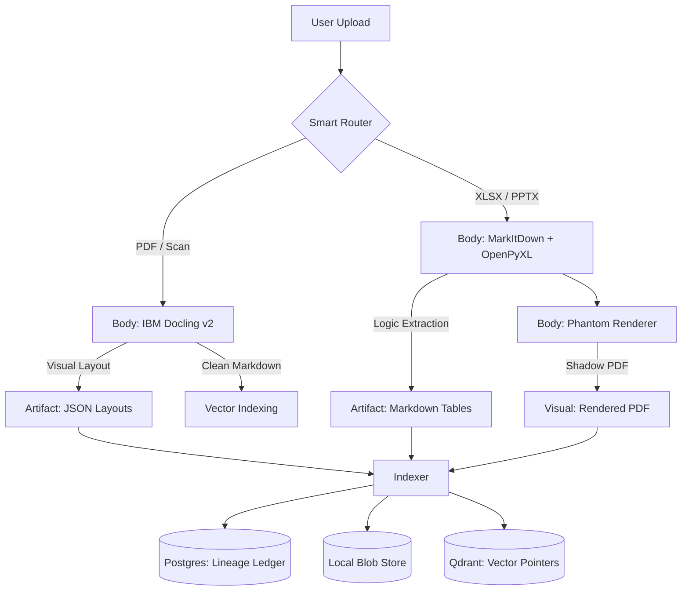

# CENTAUR: High-Fidelity Underwriting RAG

**Status:** Alpha (Ingestion Engine Active)
**Core Philosophy:** The "Centaur" Architecture (Local Body / Cloud Brain)
**Python:** 3.11+ | **Stack:** Docker, Postgres, Qdrant, LangGraph

> **🚀 Key Differentiator:** Centaur is the first open-source RAG engine specifically engineered to solve **"Semantic Collapse"** in monochromatic financial charts (e.g., Pitchbooks, Earnings Slides) using relative luminance physics.

---

## 🏛️ Executive Summary

**Centaur** is a specialized Retrieval-Augmented Generation (RAG) engine designed for **Private Credit Underwriting**. Unlike generic chat bots, Centaur treats credit agreements, indentures, and financial models as structured databases, not unstructured text.

The system is engineered to solve the **"Trust Gap"** in financial AI by enforcing three non-negotiable standards:
1.  **Pixel-Perfect Grounding:** Every generated answer must point to verifiable coordinates (visual or native) in the source document.
2.  **Audit-Ready Arithmetic:** The LLM is strictly forbidden from performing mental math. All calculations are executed via Python tools on extracted tabular data.
3.  **Cost Discipline ("The Token Firewall"):** We maximize the use of local hardware (OCR, Layout Analysis, Embedding) to minimize API costs, sending only high-value reasoning tasks to the cloud.

---

## 🏗️ System Architecture

Centaur operates on a hybrid "Body/Brain" model to balance cost and precision.

### 1. The Dual-Helix Ingestion Pipeline
We reject the "one-size-fits-all" ingestion approach. Files are routed based on their semantic structure.



### 2. The Storage Layer: "The Three Truths"
To prevent "Metadata Bloat" in the Vector DB and ensure data integrity, Centaur decouples storage into three distinct layers.

| Layer | Component | Role | Why? |
| :--- | :--- | :--- | :--- |
| **State Truth** | **PostgreSQL** | **Lineage Ledger**. Tracks document status (Draft vs. Final) and effective dates. | Prevents "Hallucinating Old Data" by filtering superseded drafts. |
| **Content Truth** | **Local Blobs** | **Artifact Store**. Stores heavy `layouts/*.json` and `tables/*.md`. | Keeps the Vector DB lightweight. Allows index rebuilding without re-ingesting. |
| **Search Truth** | **Qdrant** | **Pointer Index**. Stores embeddings and `chunk_id` references only. | Optimized purely for speed and semantic retrieval. |

### 3. The Reasoning Engine (Lexical Graph)
We utilize a **Lexical Graph** approach rather than "Semantic Hops" to solve the specific complexity of Credit Agreements.
* **Term Injection:** A Regex-driven pass extracts "Article I: Definitions" and injects them only when relevant.
* **The Phantom DOM:** For native files (Excel), the system cites a "Shadow PDF" generated by Playwright, allowing pixel-perfect citations on spreadsheet cells.

---

## 🧠 Deep Dive: The Visual Cortex (v1.1)

*New in v1.1:* Centaur utilizes a production-grade **Financial Vision Pipeline** designed to solve "Semantic Collapse" in monochromatic charts (e.g., Google Earnings, Pitchbooks).

#### A. The Universal Classifier (Heuristic Filtering)
Before processing a region, we classify it using a 4-Variable Orthogonal Model:
1.  **Alpha-Token Ratio:** Filters out prose ($>80\%$ text).
2.  **Entity Density:** Scans for financial markers ($, %, x, EBITDA) and industry units (MW, sq ft, TEU).
3.  **Geometric Alignment:** Uses dynamic clustering gaps to detect grids and "Key-Value" structures (Rent Rolls).
4.  **Guardrails:** Detects and penalizes "Table of Contents" (dots + numbers) and Legal Disclaimers.

#### B. The Vector Radar & Spatial Index
To bind text labels to data bars without hallucination, we implemented a physics engine:
* **Spatial Hashing:** Divides the page into grid buckets, reducing lookup complexity from $O(N^2)$ to $O(1)$ on complex diagrams.
* **Edge-to-Edge Physics:** Calculates distance from the *edge* of a shape, not the center. This fixes data loss on wide bar charts.
* **The "Periscope" Probe:** Allows the search radius to expand outside the visual bounding box to find Legends located in the slide header/footer.

#### C. Relative Luminance Resolution (The "Google" Fix)
LLMs fail when a chart uses "Brand Red" (`#EA4335`) vs "Dark Red" (`#A61C00`). They see both as "Red."
* **The Fix:** Centaur converts absolute Hex codes into **Relative Semantic Names** using HSL Math.
* **Output:** Instead of `Legend: Red`, the LLM receives `Legend: Luminance-73 Red (Light)` vs `Legend: Luminance-40 Red (Dark)`. This creates a deterministic link between the legend key and the data bar.

#### D. Hybrid OCR Safety Net (The "Raster Fallback")
Financial decks often contain "Zombie Charts"—Excel screenshots pasted as flat images.
* **Layer 1 (Vector):** We first probe the PDF's internal structure. If text objects exist, we use them (100% accuracy).
* **Layer 2 (Raster):** If a region contains `< 5` vector text items, the system automatically triggers **RapidOCR (ONNX)**.

#### E. Context-Aware Semantic Binding (The "Logic Split")
Standard RAG parsers treat all text equally. Centaur differentiates based on content type:
* **Legend Mode (Text):** Activates a **"Periscope Search"**, looking for colored keys *adjacent* to the text.
* **Data Mode (Numeric):** Activates **"Background Detection"**, identifying the color directly *underneath* or geometrically closest to the number.
* **The Result:** Prevents the system from confusing a value (e.g., "$20m") with a category definition.

---

## 🛡️ Engineering Standards (Strict Enforcement)

### 1. The "Token Firewall"
* **Rule:** Never send raw chunks to the LLM without stripping visual noise.
* **Implementation:** Headers, footers, and decorative artifacts are stripped locally before embedding.

### 2. Auditability & Citations
* **Rule:** Every answer must return a `Citation` object.
* **Implementation:** Use the `src.schemas.citation.Citation` model. Citations must map to the `shadow_cache` for visualization.

### 3. No Mental Math
* **Rule:** If the user asks for a calculation (e.g., "Leverage Ratio"), the Agent **MUST** use the `calculator` tool.
* **Implementation:** Python handles the math; the LLM handles the logic.

### 4. Asynchronous Purity
* **Rule:** No blocking operations on the main event loop.
* **Implementation:** All CPU-bound tasks (OCR, Image Processing) must be offloaded to `ThreadPoolExecutor` to ensure high concurrency.

---

## 📂 Repository Map

```text
centaur/
├── data/                       # [SINGLE SOURCE OF TRUTH]
│   ├── inputs/                 # Drop zone for raw PDFs/Excel
│   ├── system/                 # The State Truth (Dev mode hook)
│   ├── blobs/                  # The Content Truth (Simulates Azure Blob Container)
│   │   ├── layouts/            # JSON Coordinate Maps
│   │   └── tables/             # Full Markdown Tables
│   └── shadow_cache/           # The Visual Truth (Phantom PDFs)
├── src/
│   ├── config.py               # Factory Pattern: Toggles OpenAI (Dev) <-> Azure (Prod)
│   ├── ingestion/              # [LOCAL BODY] The Dual-Helix Engine
│   │   ├── filters.py          # Token Firewall logic
│   │   ├── native_parser.py    # MarkItDown + OpenPyXL fallback
│   │   ├── pdf_parser.py       # Docling v2 with Visual Context Injection
│   │   ├── phantom.py          # Playwright "Shadow PDF" generator
│   │   ├── pipeline.py         # The Orchestrator
│   │   └── router.py           # Smart routing (Visual vs Native)
│   ├── retrieval/              # [SEARCH TRUTH - READ]
│   │   ├── qdrant.py           # Search Logic (The "Brain" uses this)
│   │   ├── sidecar.py          # Context Window Manager
│   │   └── term_injector.py    # Regex Definitions Extractor
│   ├── schemas/                # [TYPE SAFETY] Shared Pydantic Models
│   │   ├── citation.py         # "Pixel-Perfect" citation object
│   │   ├── documents.py        # Chunk definitions
│   │   └── state.py            # LangGraph state schema
│   ├── storage/                # [THE THREE TRUTHS - WRITE]
│   │   ├── blob_driver.py      # Content Truth (Writes to blobs/)
│   │   ├── db_driver.py        # State Truth (Writes to Postgres)
│   │   └── vector_driver.py    # Search Truth (Writes to Qdrant)
│   ├── tools/                  # [AGENT TOOLS]
│   │   ├── calculator.py       # Python Math Engine
│   │   ├── database.py         # SQL Lookup Tool
│   │   └── vision.py           # GPT-4o Visual Analysis Tool
│   ├── utils/                  # [OBSERVABILITY]
│   │   ├── resilience.py       # Retry decorators & JSON repair
│   │   ├── telemetry.py        # Cost tracking
│   │   └── tracing.py          # LangSmith connection
│   └── workflows/              # [CLOUD BRAIN] LangGraph Logic
│       ├── graph.py            # The State Machine Controller
│       ├── router.py           # Semantic Intent Router
│       └── nodes/              # Discrete Reasoning Steps
│           ├── financial_math.py
│           └── legal_reasoning.py
├── test/
│   ├── benchmarks/
│   │   └── cost_analysis.py
│   └── units/
├── .env
├── docker-compose.yml
├── README.md
├── requirements.txt
└── run_ingestion.py            # [TRIGGER] Manual entry point